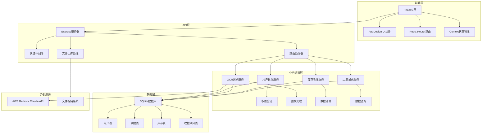
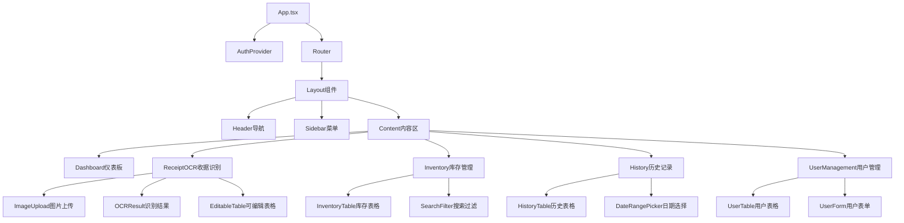

# 代购管理系统设计文档

## 概述

代购管理系统是一个基于Web的全栈应用程序，采用前后端分离架构。系统提供用户权限管理、OCR收据识别、库存管理和历史记录查看等核心功能。前端使用React + TypeScript + Ant Design构建现代化用户界面，后端使用Node.js + Express + SQLite提供RESTful API服务。

## 架构

### 系统架构图



### 技术栈

**前端技术栈：**
- React 18 + TypeScript - 现代化前端框架
- Ant Design - 企业级UI组件库
- React Router - 客户端路由管理
- Axios - HTTP客户端
- Context API - 状态管理

**后端技术栈：**
- Node.js + Express - 服务器框架
- TypeScript - 类型安全
- SQLite - 轻量级数据库
- bcrypt - 密码加密
- JWT - 身份认证
- multer - 文件上传处理
- helmet - 安全中间件
- AWS SDK v3 - Bedrock Claude API集成
- sharp - 图像预处理和优化

## 组件和接口

### 前端组件架构



### API接口设计

**认证接口 (/api/auth)**
```typescript
POST /api/auth/login
Body: { username: string, password: string }
Response: { token: string, user: UserInfo }

POST /api/auth/register
Body: { username: string, password: string, role?: string }
Response: { message: string }

GET /api/auth/profile
Headers: { Authorization: "Bearer <token>" }
Response: { user: UserInfo }
```

**收据管理接口 (/api/receipts)**
```typescript
POST /api/receipts/upload
Headers: { Authorization: "Bearer <token>" }
Body: FormData with image file
Response: { ocrResult: OCRResult }

POST /api/receipts/save
Headers: { Authorization: "Bearer <token>" }
Body: { items: ReceiptItem[], totalAmount: number }
Response: { receiptId: number }

GET /api/receipts
Headers: { Authorization: "Bearer <token>" }
Query: { page?: number, limit?: number, startDate?: string, endDate?: string }
Response: { receipts: Receipt[], total: number }
```

**库存管理接口 (/api/inventory)**
```typescript
GET /api/inventory
Headers: { Authorization: "Bearer <token>" }
Query: { search?: string, page?: number, limit?: number }
Response: { items: InventoryItem[], total: number }

POST /api/inventory
Headers: { Authorization: "Bearer <token>" }
Body: { itemName: string, currentStock: number, unitPrice: number }
Response: { item: InventoryItem }

PUT /api/inventory/:id
Headers: { Authorization: "Bearer <token>" }
Body: { currentStock?: number, unitPrice?: number }
Response: { item: InventoryItem }
```

**用户管理接口 (/api/users)**
```typescript
GET /api/users
Headers: { Authorization: "Bearer <token>" }
Response: { users: User[] }

POST /api/users
Headers: { Authorization: "Bearer <token>" }
Body: { username: string, password: string, role: string }
Response: { user: User }

PUT /api/users/:id
Headers: { Authorization: "Bearer <token>" }
Body: { role?: string, password?: string }
Response: { user: User }
```

## 数据模型

### 数据库表结构

**用户表 (users)**
```sql
CREATE TABLE users (
  id INTEGER PRIMARY KEY AUTOINCREMENT,
  username TEXT UNIQUE NOT NULL,
  password TEXT NOT NULL,           -- bcrypt加密
  role TEXT NOT NULL DEFAULT 'user', -- 'admin' | 'user'
  created_at DATETIME DEFAULT CURRENT_TIMESTAMP,
  updated_at DATETIME DEFAULT CURRENT_TIMESTAMP
);
```

**收据表 (receipts)**
```sql
CREATE TABLE receipts (
  id INTEGER PRIMARY KEY AUTOINCREMENT,
  user_id INTEGER NOT NULL,
  image_path TEXT,                  -- 原始收据图片路径
  total_amount REAL,
  created_at DATETIME DEFAULT CURRENT_TIMESTAMP,
  updated_at DATETIME DEFAULT CURRENT_TIMESTAMP,
  FOREIGN KEY (user_id) REFERENCES users (id)
);
```

**收据项目表 (receipt_items)**
```sql
CREATE TABLE receipt_items (
  id INTEGER PRIMARY KEY AUTOINCREMENT,
  receipt_id INTEGER NOT NULL,
  item_name TEXT NOT NULL,
  unit_price REAL NOT NULL,
  quantity INTEGER NOT NULL,
  total_price REAL NOT NULL,
  created_at DATETIME DEFAULT CURRENT_TIMESTAMP,
  FOREIGN KEY (receipt_id) REFERENCES receipts (id) ON DELETE CASCADE
);
```

**库存表 (inventory)**
```sql
CREATE TABLE inventory (
  id INTEGER PRIMARY KEY AUTOINCREMENT,
  item_name TEXT UNIQUE NOT NULL,
  current_stock INTEGER DEFAULT 0,
  unit_price REAL,
  last_updated DATETIME DEFAULT CURRENT_TIMESTAMP
);
```

### TypeScript类型定义

```typescript
interface User {
  id: number;
  username: string;
  role: 'admin' | 'user';
  createdAt: string;
  updatedAt: string;
}

interface Receipt {
  id: number;
  userId: number;
  imagePath?: string;
  totalAmount: number;
  items: ReceiptItem[];
  createdAt: string;
  updatedAt: string;
}

interface ReceiptItem {
  id?: number;
  receiptId?: number;
  itemName: string;
  unitPrice: number;
  quantity: number;
  totalPrice: number;
}

interface InventoryItem {
  id: number;
  itemName: string;
  currentStock: number;
  unitPrice: number;
  lastUpdated: string;
}

interface OCRResult {
  items: Omit<ReceiptItem, 'id' | 'receiptId'>[];
  totalAmount: number;
  confidence: number;
}
```

## 错误处理

### 前端错误处理策略

1. **网络错误处理**
   - 使用Axios拦截器统一处理HTTP错误
   - 显示用户友好的错误消息
   - 自动重试机制（适用于临时网络问题）

2. **表单验证错误**
   - 使用Ant Design的Form组件内置验证
   - 实时验证用户输入
   - 显示具体的验证错误信息

3. **权限错误处理**
   - 检测401/403状态码自动跳转登录页
   - 隐藏无权限访问的UI元素
   - 显示权限不足提示

### 后端错误处理策略

1. **全局错误中间件**
```typescript
app.use((err: Error, req: Request, res: Response, next: NextFunction) => {
  console.error(err.stack);
  
  if (err.name === 'ValidationError') {
    return res.status(400).json({ error: '数据验证失败', details: err.message });
  }
  
  if (err.name === 'UnauthorizedError') {
    return res.status(401).json({ error: '未授权访问' });
  }
  
  res.status(500).json({ error: '服务器内部错误' });
});
```

2. **数据库错误处理**
   - 捕获SQLite约束违反错误
   - 处理连接超时和锁定错误
   - 提供数据库备份和恢复机制

3. **文件上传错误处理**
   - 限制文件大小和类型
   - 处理磁盘空间不足错误
   - 清理临时文件

## 测试策略

### 前端测试

1. **单元测试**
   - 使用Jest + React Testing Library
   - 测试组件渲染和用户交互
   - 测试工具函数和业务逻辑

2. **集成测试**
   - 测试组件间的数据流
   - 测试路由导航
   - 测试API调用集成

3. **端到端测试**
   - 使用Cypress测试完整用户流程
   - 测试关键业务场景
   - 测试跨浏览器兼容性

### 后端测试

1. **单元测试**
   - 使用Jest测试业务逻辑函数
   - 测试数据库操作
   - 测试中间件功能

2. **API测试**
   - 使用Supertest测试API端点
   - 测试认证和授权
   - 测试错误处理

3. **数据库测试**
   - 使用内存数据库进行测试
   - 测试数据迁移
   - 测试数据完整性约束

## AWS Bedrock Claude集成设计

### Bedrock Claude OCR服务架构

```typescript
interface BedrockOCRService {
  // 配置AWS Bedrock客户端
  initializeBedrockClient(): BedrockRuntimeClient;
  
  // 图像预处理
  preprocessImage(imagePath: string): Promise<Buffer>;
  
  // 调用Claude模型进行OCR
  invokeClaudeForOCR(imageBuffer: Buffer): Promise<OCRResult>;
  
  // 构建结构化提示词
  buildOCRPrompt(): string;
  
  // 解析Claude响应
  parseClaudeResponse(response: string): ReceiptItem[];
}
```

### Claude提示词设计

```typescript
const OCR_PROMPT = `
请分析这张收据图片，提取其中的商品信息。请返回JSON格式的数据，包含以下字段：

{
  "items": [
    {
      "itemName": "商品名称",
      "unitPrice": 单价(数字),
      "quantity": 数量(整数),
      "totalPrice": 小计金额(数字)
    }
  ],
  "totalAmount": 总金额(数字),
  "confidence": 识别置信度(0-1之间的数字)
}

注意事项：
1. 仔细识别中文商品名称
2. 准确提取价格数字，忽略货币符号
3. 如果某个商品没有明确的数量，默认为1
4. 计算验证小计是否等于单价×数量
5. 忽略非商品信息（如店名、地址、时间等）
`;
```

### AWS配置管理

```typescript
interface AWSConfig {
  region: string;
  accessKeyId: string;
  secretAccessKey: string;
  bedrockModelId: string; // 例如: "anthropic.claude-3-sonnet-20240229-v1:0"
}

// 环境变量配置
const awsConfig: AWSConfig = {
  region: process.env.AWS_REGION || 'us-east-1',
  accessKeyId: process.env.AWS_ACCESS_KEY_ID!,
  secretAccessKey: process.env.AWS_SECRET_ACCESS_KEY!,
  bedrockModelId: process.env.BEDROCK_MODEL_ID || 'anthropic.claude-3-sonnet-20240229-v1:0'
};
```

### 错误处理和重试机制

```typescript
class BedrockOCRService {
  private async invokeWithRetry(params: any, maxRetries = 3): Promise<any> {
    for (let attempt = 1; attempt <= maxRetries; attempt++) {
      try {
        return await this.bedrockClient.invokeModel(params);
      } catch (error) {
        if (attempt === maxRetries) throw error;
        
        // 指数退避重试
        await new Promise(resolve => setTimeout(resolve, Math.pow(2, attempt) * 1000));
      }
    }
  }
}
```

### OCR功能测试

1. **Bedrock Claude集成测试**
   - 测试AWS凭据配置和连接
   - 测试不同Claude模型版本的性能
   - 测试API调用限制和配额管理
   - 测试网络超时和重试机制

2. **图像处理测试**
   - 测试不同格式的收据图片（JPG、PNG、HEIC等）
   - 测试图像大小限制和压缩效果
   - 测试图像质量对识别准确率的影响
   - 测试手写和机打收据的识别效果

3. **识别准确性测试**
   - 建立中文收据测试数据集
   - 测量识别准确率和召回率
   - 对比Claude与传统OCR的性能差异
   - 持续优化提示词和参数配置

### 性能测试

1. **负载测试**
   - 测试并发用户访问
   - 测试大文件上传性能
   - 测试数据库查询性能

2. **压力测试**
   - 测试系统极限负载
   - 测试内存和CPU使用情况
   - 测试系统恢复能力